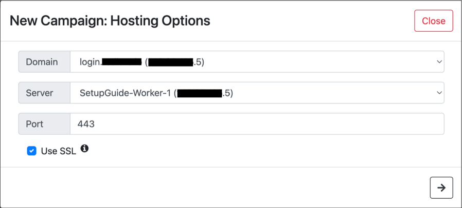
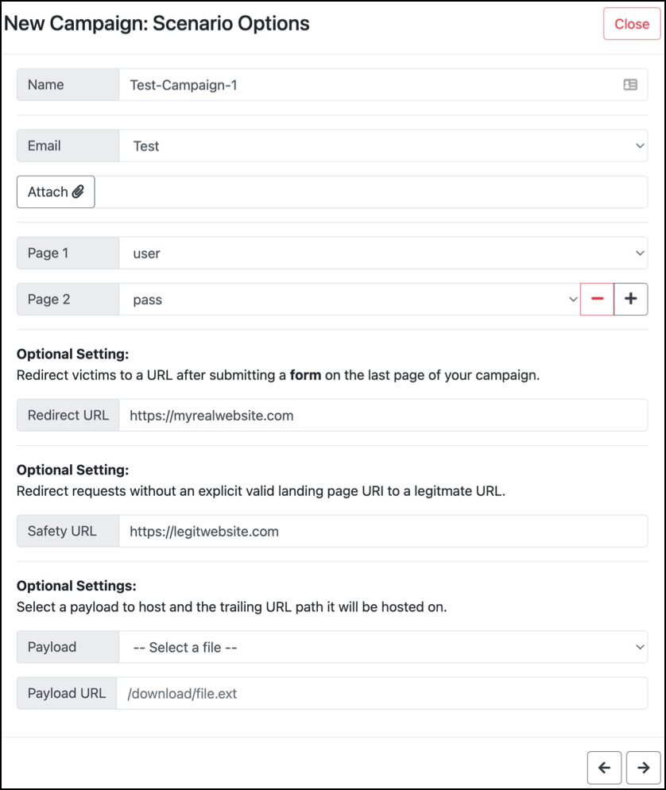

# Campaigns
The campaigns page is used to create and manage new phishing campaigns within the workspace. Each campaign has a status and several functions are available for each campaign.

## Campaign Statuses
Each campaign has a single status at any given point in time. The statuses are:
* __Scheduled__ - The campaign is scheduled to be run. (Campaigns that are supposed to start immediately will show this status for several seconds before starting.)
* __Active__ - The campaign is running (worker has begun hosting) and emails are in the process of sending or sent.
* __Completed__ - The campaign has been already been run and killed.
* __Start time missed (server outage)__ - The console was down at the time the campaign was supposed to start. (If the console is taken down and restarted before a previously scheduled campaign is supposed to run, it will be reinserted into the job queue on console startup.)
* __Error__ - The campaign attempted to start, but a process was already bound to the selected port on the worker.

## Campaign Functions
Each campaign has the following functions (buttons):
* __Configs__ - Shows most of the settings chosen when configuring a new campaign. Configurations can not be chosen in retrospect.
* __Clone__ - Starts the configuration of a new campaign, with most of the options pre-filled with selections from the chosen campaign.
* __Kill__ (only active campaigns) - Kills the webserver process running on the redlure-worker and deletes campaign templates from disk on the worker.
* __Delete__ - **This will delete your campaign and all associated objects (i.e. results, events, form data) from the database permanently.** If a campaign is scheduled, this will remove the job from the queue. If a campaign is currently active, it will first kill the campaign, then delete it, and remove any pending jobs from the queue (scheduled emails will not continue to send after deletion).

# Creating a New Campaign
Campaign creation settings are organized into three groups: server options, scenario options, and sending options.

## Server Options
* __Domain__ - Choose the domain added on the `Domains & Servers` page that will be used. This will affect the URL in the phishing email. If SSL is used, the specified certs for this domain will also be used.
* __Server__ - The redlure-worker the phishing site will be hosted on. IP must line up with the IP of the chosen domain.
* __Port__ - The port the chosen redlure-worker will host the phishing site on.
* __SSL__ - Uncheck the SSL box to host over plain HTTP.

Once all settings are selected and the :arrow_right: button is clicked, redlure will verify that the domain resolves to the IP of the selected redlure-worker and (if SSL is selected) that the specified cert/key file paths exist on the redlure-worker. You will not be able to advance if either of these checks fail. redlure does not check if the chosen port is already in use on the selected worker (This can be manually checked on the `Domains & Servers` page).

## Scenario Options
* __Name__ - Name of the campaign.
* __Email__ - Email body template that will be sent.
* __Pages__ - HTML template(s) to host. `Page 1` is a required selection, subsequent pages are optional.
* __Redirect URL__ - Optional setting. URL that visitors will be sent to after submitting the last form in your selected pages.
* __Safety URL__ - Optional setting. Visitors that don't supply a valid URI to one of your hosted pages will be redirected to this URL if set. If not set, visitors without a vaild URI will just be redirected to the first hosted page you've configured.
* __Payload__ - Optional setting. Select a payload previously uploaded to your worker (on `Domains & Servers` page) that can be referenced in your email and page templates.
* __Payload URL__ - Optional setting. The trailing URL path the worker will host the selected payload on.

## Sending Options
* __List__ - The target list which will receive the phishing email.
* __Profile__ - The mail configs used to send the emails.
* __Batch sending__ (Send _ Emails Every _ Minutes) - Optional setting. If configured, emails will be sent in groups (i.e. send 5 emails every 30 minutes). If this is left blank, the default is to send all emails at once.
* __Start Time__ - Optional setting. Schedule the campaign to start at a future date and time. Time must be local to the console's time (shown below the currently set date/time). If left blank, the default is to schedule the campaign to run 8 seconds in the future. __Warning: This may be a little buggy.__

