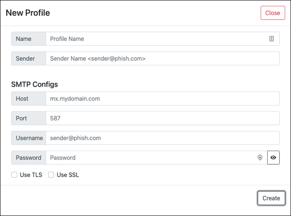

# Profiles
The profiles component is where you configure the account and mail server you are sending emails with, as well as, who the sender will appear as upon email receipt.

Profiles can be configured to use services like SendGrid and Mailgun or self-hosted mail infrastructure (I personally love to use [Mailcow](https://github.com/mailcow/mailcow-dockerized) and have a setup guide [here](https://tw1sm.github.io/2022-01-25-mailcow/)).

After you create and save a profile, I recommend sending a test email with it from the Profiles page to make sure everything is setup correctly. (Test email is a fake dinner invite.) [mail-tester.com](https://mail-tester.com) is a great resource you can send a test to in order to determine if your SPF, DMARC and DKIM are working as intended.

Options for setting up a new profile:
