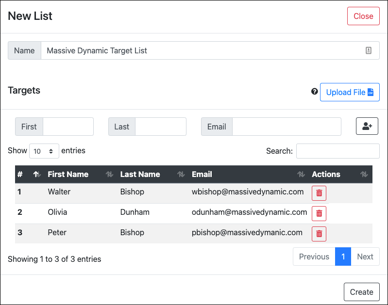

# Target Lists
The target lists component is where you add your email recipients. Currently, campaigns can only be sent to a single list at a time. 

Users can be added via the built-in form or through an uploaded CSV file. CSV headers are `first,last,email`. Only email is required. First and last names can be referenced as variables in templated [emails](emails.md).

Examples:
```
first,last,email
Walter,Bishop,wbishop@massivedynamic.com
Olivia,Dunham,odunham@massivedynamic.com
Peter,Bishop,pbishop@massivedymanic.com
Philip Broyles,pbroyles@massivedynamic.com
```

```
email
wbishop@massivedynamic.com
odunham@massivedynamic.com
pbishop@massivedymanic.com
pbroyles@massivedynamic.com
```

