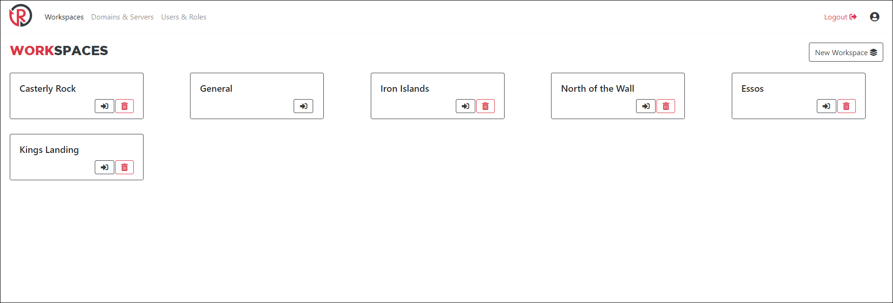

# Workspaces
Workspaces are there to help organize your engagements and aggregate results in a meaningful way. When you create a workspace and add components to it (emails, pages, etc.), those components will only be shown and usable for campaigns in that workspace.

Deleting a workspace will also delete all objects stored within it (results, emails, pages, etc).

## The General Workspace
Components placed in the general workspace will be available for use in other workspaces, but won't appear in other workspaces. This is a good place to store templates you use across engagements without modification each time.

Typically, I store all my non-client specific templates in the General workspace and then if any require client-specific edits, I'll use the import feature to copy it to my client workspace.