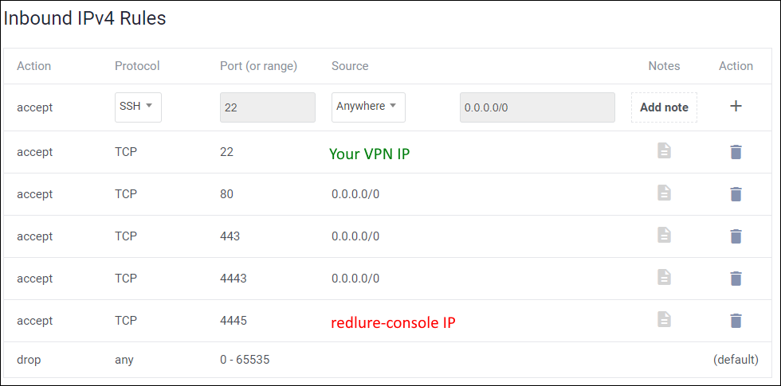

# Recommended Firewall Setup
This is how I typically configure the firewall on redlure-workers, although it may vary depending on your use case. 

The recommended firewall setup for the redlure-console can be found [here](../redlure-console/firewall.md).

Basics to consider:
- Target access to your phishing sites - make sure to allow access to all ports you intend to host phishing sites from. In the example below I've allowed 80,443 and 4443.
- SSH access - you'll need to perform setup and may want to check logs. Ideally SSH access is limited to your own VPN or infrastructure.
- redlure-console communications - perhaps most importantly, the redlure-console you connect the worker to will need to be able communicate inbound on the port the worker API is hosted on (4445 by default).

